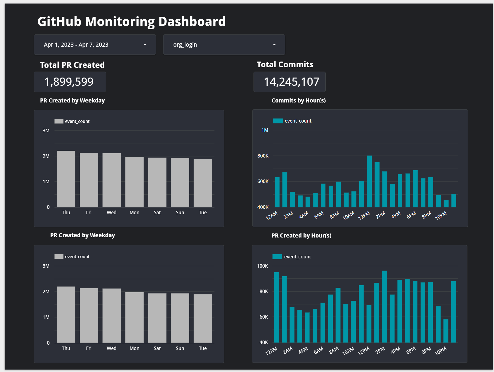

# Github Archive Data Pipeline

Reproducible end-to-end data pipeline to transform ecommerce purchase data into actionable insights

### Table of contents
- [Objective](#introduction)
- [Use Cases](#use-cases)
- [Dashboard](#dashboard)
- [Tools & Data](#tools-data)
- [Implementation Plan](#implementation-plan)
---

## Objective

In this final project, my objective is to design and implement a robust data pipeline that extracts data from the GitHub Archive, transforms it to fit a BigQuery data model, and loads it into BigQuery tables for easy querying and analysis.

In addition to creating the pipeline, I will also be responsible for designing and building a web-based dashboard that provides real-time insights into the data. This dashboard will enable organizations to monitor their GitHub activity and identify trends and patterns that can help improve their development processes.

The key steps involved in this project include:
- Data Extraction: Extracting the relevant data from the GitHub Archive using the GitHub API and other tools.
- Data Transformation: Transforming the data to fit a BigQuery schema, which involves cleaning, aggregating, and enriching the data as necessary.
- Data Loading: Loading the transformed data into BigQuery tables for efficient querying and analysis.
- Dashboard Design and Implementation: Designing and building a monitoring dashboard that provides real-time insights into the data.

---

## Use Cases
- User Story 1: As a development team lead, I want to be able to monitor our team's GitHub activity over time and review with my team, so that I can identify issues and bottlenecks and make data-driven decisions to improve our development processes.
- User Story 2: As a product manager, I want to be able to analyze our organization's GitHub activity over time, so that I can understand trends and identify areas for improvement.
- User Story 3: As a data analyst, I want to be able to query and analyze our organization's GitHub data, so that I can answer specific questions and generate custom reports about our main activities (commits/pull requests)
---

## Dashboard

---

## Tools & Data 
### **Dataset**
- [Github (GH) Archive](https://www.gharchive.org/) is a project that captures a record of all public activity on Github, dating back to 2011. This includes information about events like commits, pull requests, issues, and releases. 
- The data is stored in JSON format, with each file representing one hour of activity. The files are organized into directories by year, month, and day.
- The size of the Github Archive data is constantly growing as new events are added. As of May 2023, the uncompressed size of the entire dataset is over 1.2 terabytes, with each hourly JSON file averaging around 500 megabytes. It is important to note that this data is compressed when stored and transferred, and the actual storage and transfer requirements may vary depending on the specific use case.
- Due to the size, we are working with only 2023 April data

### **Tools** 
- Google Cloud Platform (GCP): GCP is a cloud-based platform that provides a variety of services for building and deploying applications, storing and analyzing data, and managing infrastructure.
- Pandas: Pandas is a Python library that provides data manipulation and analysis tools. It is commonly used for tasks such as data cleaning, data exploration, and data visualization. 
- Docker: Docker is a platform for containerization, which allows applications and their dependencies to be packaged into lightweight containers that can be deployed and run consistently across different environments. 
- Prefect: Prefect is a Python-based workflow management system that allows you to define and execute complex data pipelines. It provides features like scheduling, monitoring, and error handling.
- Google Cloud Storage: Google Cloud Storage is a cloud-based object storage service that allows you to store and retrieve data at scale. 
- Google BigQuery: Google BigQuery is a cloud-based data warehouse that allows you to store, query, and analyze large datasets. It provides features like scalability, performance, and ease of use.
- Looker Studio: Looker Studio is a cloud-based business intelligence and data analytics platform that allows you to visualize and explore data from various sources. 

### **Implementation Plan** 

- Set up a Google Cloud Platform (GCP) account and create a project.
- Provision Virtual Machine (VM) instances to run the necessary infrastructure.
- Use Terraform to create a network infrastructure
- Create a Google Cloud Storage bucket to store the Kaggle dataset files.
- Use Pandas to extract the data from the GH Archive datasets and load it into BigQuery using the cli commands from gcloud.
- Set up Prefect for data orchestration to schedule and manage the pipeline workflow. Use Docker to containerize the pipeline components for portability and consistency for this step.
- Use Dbt to transform and model the data in BigQuery into a structured format for reporting.
- Set up Looker studio to connect to BigQuery and visualize the data.

