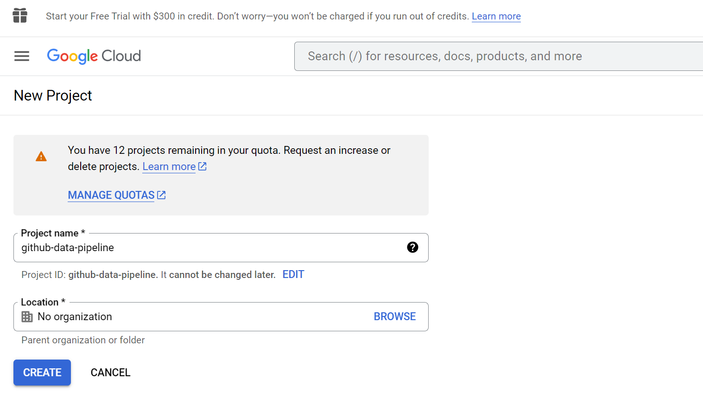
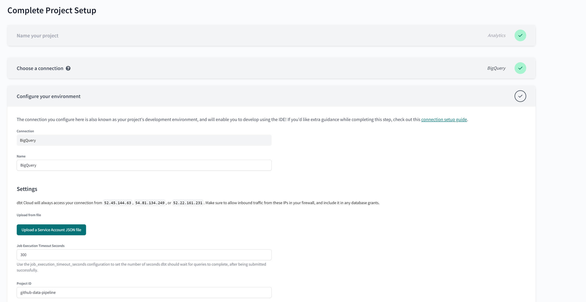
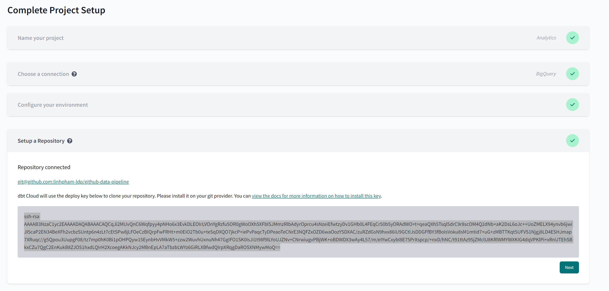

# Step-by-step instructions on reproducing the project

## **Infrastructure set-up**
### Prerequisites
The following requirements are needed to reproduce the project:

1. A [Google Cloud Platform](https://cloud.google.com/) account
1. A [Kaggle](https://www.kaggle.com/) account
1. (Optional) The [Google Cloud SDK](https://cloud.google.com/sdk). Instructions for installing it are below.
    * Most instructions below will assume that you are using the SDK for simplicity.
1. (Optional) A SSH client
    * All the instructions listed below assume that you are using a Terminal and SSH.
1. (Optional) VSCode with the Remote-SSH extension
    * Any other IDE should work, but VSCode makes it very convenient to forward ports in remote VM's.
<br>

### Step 1: Set up a Google Cloud project 
We should be able to create a new project and its corresponding service account.
<details>
  <summary>For more details, click here</summary>
    
  > 1. Create a GCP **New Project** 

  > 
  >
  > 2. **Switch** to the project
  > 3. Go to *IAM & Admin / Service Account /* **Create service account**
  > 4. *Service account details* --> set *Service account name* (it's up to you) --> **Create and continue**
  > 5. In *Grant this service account access to project* ---> add the following roles:
  >    - Add **Basic / Viewer** *(optional)*
  >    - Add **Cloud Storage / Storage Admin**
  >    - Add **Cloud Storage / Storage Object Admin**
  >    - Add **BigQuery Admin**
  >    --> Click "Done"
  > 6. Go to *Service Accounts / 3 dots under Actions* --> **Manage Keys**
  > 7. Go to *Add key /* **Create new key** --> Choose **JSON** format
  > A json file will be downloaded to a default folder in your local machine (It's the Downloads folder for me). Let's remember the path to the file as we will need it in the next step.
</details>
<br>

### Step 2: Set up a VM instance on GCP

We want to run and deploy our data pipeline via a virtual machine on Google Cloud Platform (GCP). This will allow us to leverage Google's high-performance infrastructure (with cost but we have the free $300 credit granted to a new account).

<details>
  <summary>For more details, click here</summary>
    
  > 1. Go to *Compute Engine / Settings / Metadata* --> Make sure the public SSH key is added (follow [Google Cloud instructions here](https://cloud.google.com/compute/docs/connect/create-ssh-keys)) 
  > 2. Go to *Compute Engine / VM instances /* --> Enable **Compute Engine** API (this step is not needed is the API has already been enabled, you will see manage instead)
  > 3. Under *VM instances /* --> **Create instance**
  > 4. In *Grant this service account access to project* ---> add the following roles:
  >    - Name = your choice 
  >    - Region, Zone = select a region near you/I used the default one for Zone
  >    - Machine Type = 4vCPu, 16 GB Memory (e2-standard-4)
  >    - Boot Disk:
  >         - Select Ubuntu and Ubuntu 20.04 LTS (x86/64) as the Operating System and Version
  >         - Size = 30 GB
  > 5. Click "CREATE"

</details>
<!-- Install Anaconda 
Command: wget https://repo.anaconda.com/archive/Anaconda3-2023.03-Linux-x86_64.sh
 To use Anaconda: bash Anaconda3-2023.03-Linux-x86_64.sh -->

### Step 3: Terraform
Clone the Git repo

```bash
 >>> git clone https://github.com/linhpham-ldp/github-data-pipeline.git
```
Your virtual machine should already have Terraform installed. Change directory to terrform

Initialize terraform
```bash
terraform init
```

Next step is to plan the infrastructure:

```bash
terraform plan
```

Terraform will ask for your Project ID. Type it and press enter to let Terraform access GCP

```bash
terraform apply
```

In Google Cloud Storage, you should be able to see the data lake bucket.
In Big Query, you should be able to see gh_archive_staging, gh_archive_production, gh_archive_development.

---

## **Data Pipeline**

### Step 1: Data ingestion
We will use Prefect Cloud to monitor the flow.

```bash
 >>> prefect deployment run etl-main-flow/github-data-pipeline # (to avoid waiting for the cronjob time)
 >>> prefect agent start --work-queue "default"
```

### Step 2: Data Modeling
We will use dbt Cloud to monitor the flow. 
<details>
  <summary>Forsetup screenshots, click here</summary>
  > 
  > 
  > 
  > 
  > 

</details>

- You can send the transformed data to the **gh_archive_development** database by using `dbt build --var 'is_test_run: false'` in the DBT console (not your terminal).
- You can send the transformed data to the **gh_archive_production** database by clicking **Run now** on the Job Page (under Deploy)

### Step 3: Dashboarding in Looker Studio!


